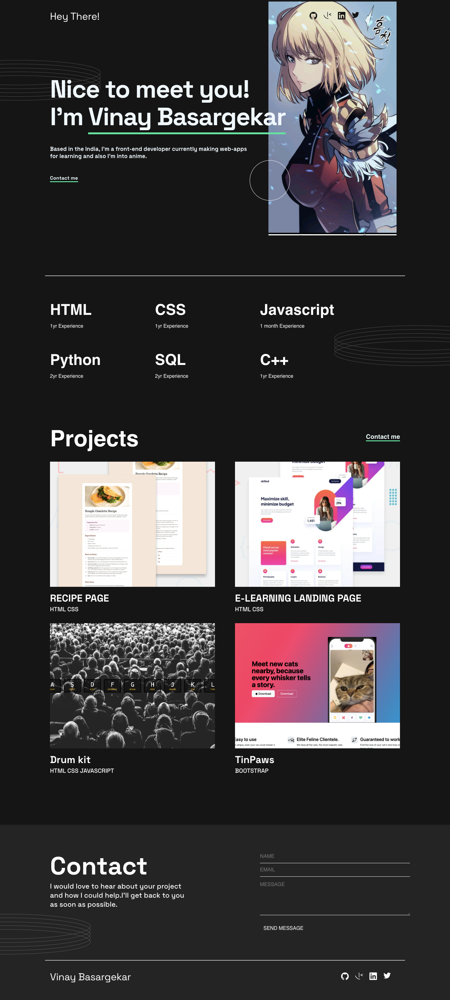

# Single-page portfolio 

## Screenshot

## Links

- Live Site URL: [Visit again!](https://portfolio-webpage-lake.vercel.app/)

## Built with

- Semantic HTML5 markup
- CSS
- Flexbox
- CSS Grid

## What I learned

The way the hover appears and the form section at the end. I love how it turned out!
I would love to hear your suggestion over this :smile:

## Continued development

- Need to create more responsive webpage as I find difficulty for my webpage to build for different screen size.

## Useful resources

- [Helped me in positioning](https://www.youtube.com/watch?v=fF_NVrd1s14) - The youtube video helped me with the positioning images using position: relative and absolute.

